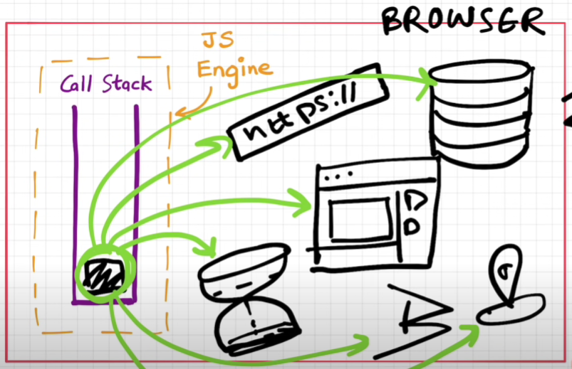

https://www.youtube.com/watch?v=8zKuNo4ay8E

### Call Stack

call stack inside JS Engine，Engine run in the Browser

将global execution context(GEC) push到stack中，然后按顺序将程序push到call stack中执行，所有执行完后，GEC也pop出stack

GEC帮我们创建了global object -> window

broser has all the super powers, JS通过window关键字，访问到所有的Web APIs

- setTimeout() -> browser's timer
- DOM APIs -> dom tree which browser renders
- fetch() -> browser send request
- localStorage -> browser's local storage
- console -> browser's console
- location -> browser's address bar（URL bar）

### Event Loop & Callback Queue(Task Queue)

when callback method triggered, if is pushed to callback queue

在stack已经空了的情况下，then event loop move callback function in callback queue to call stack

Event Loop：唯一的任务就是一直监视call stack（是否为空）和queue（是否有cb），将queue中的cb置入call stack

### Microtask Queue

和callback queue相似，但是有更高的执行优先级

only callback function in Promise & MutationObserver会来到这个queue

JS是单线程运行stack中的任务，但是browser在多线程执行任务

### Starvation of Callback Queue

如果Microtask Queue中的任务递归建立Microtask，Callback Queue中的任务会饿死

### JS Engine到底做了些什么

Browser可以运行JS程序，因为它有JS Runtime Env.

Node.js可以运行JS outside browser，因为它有JS Runtime Env

JavaScript Runtime Environment包含了JS Engine，API，EventLoop, CQ, MQ综上所述

JS Engine is the heart❤ of the JS Runtime Env

而API由Browser/Node.js提供给JS Engine，API的内部实现是不一样的

ECMAScript位JS Engine提供了标准，每个浏览器的实现是不同的

https://www.youtube.com/watch?v=2WJL19wDH68 7:00