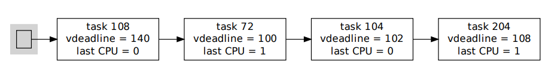

# FIFO

# SJF

# MLFQ

Multi-Level Feedback Queue，早期Linux，Windows等操作系统使用的算法

Linux中称为**O(1) scheduler**

优先级高 = 时间片分配少，优先级低 = 时间片分配多

当前CPU维护自己的多层任务队列

如果在给定时间片内，任务没有执行完毕，则会降低其优先级，然后从active queue置入expire queue

最终将两个queue交换，继续从优先级高的任务开始，执行active queue中的任务

插入任务时间O(1)，选择任务时间O(1)

	

但是在平衡IO-bound process和CPU-bound process的时间分配这方面，无法得到完美解答。

方案一：如果给定时间片内直接IO了，就降低优先级（更多时间片），但是恶意程序可以故意在时间片末尾执行IO，来获得下一个周期更长的时间片。

方案二：使用复杂的算法（sleep时间长度？），来辨别任务是IO-bound还是CPU-bound，效率降低

> Linux 2.6.23 (October 2007)被CFS替代

# CFS

Complete Fair Scheduler，基于步长算法（Stride Scheduling）

基于公平度来调度任务，而不是基于时间片的分配。

当一个任务执行完毕，其他任务都觉得更不公平，但O(n)的增加所有任务的不公平值，非常耗费时间。

当前CPU的所有任务使用红黑树存储，每个任务使用virtual runtime记录它的CPU使用时长，每次O(1)的选取vr最短的任务执行，直到它不再是最短vr的任务，O(logN)的插入红黑树。

需要维护minimum vruntime value，当任务被创建时，给他赋值。

当任务被从blocking中唤醒时，它的vr是max(oldvr, min vr - schedular latency)，保证blocking很久的任务不会在唤醒后独占很久CPU

> schedular latency值得是任务调度所产生的开销

	

# BFS

Brain Fuck Scheduler，基于步长算法（Stride Scheduling）

所有CPU的所有任务存储在一个链表中，每个任务记录virtual deadline和上次执行它的cpu，O(n)遍历，选出deadline更早的任务执行（对于相同的cpu，会视为更早的deadline，给予cpu cache激励）

任务blocks时也会记录它的deadline。

> designed for the Linux kernel in August 2009 as an alternative to CFS

# 结论

The results indicate that CFS outperformed BFS with minimizing turnaround time but that BFS
outperformed CFS for minimizing latency. This indicates that BFS is b etter for interactive tasks
that block on I/O or user input and that CFS is better for batch pro cessing that is CPU bound.

https://www.cs.unm.edu/~eschulte/classes/cs587/data/bfs-v-cfs_groves-knockel-schulte.pdf

# 其他相关Q&A

**为什么我的CPU不是时时刻刻100%运转？**

其实是在100%运转，只不过OS会添加Idle task，来填补空闲时间，让CPU不要时刻高度负荷。

	

