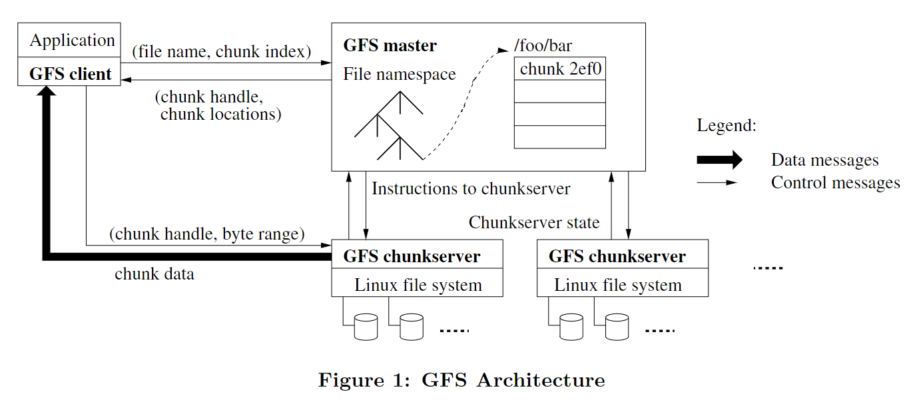
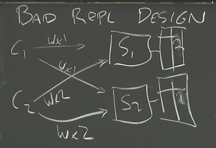

# GFS

​	

files are diveded into fixed-size chunks

client never wirte/read from master, it ask the master which chunkservers it should contact

read/write

1. client split file into fixed-size chunks
2. send master a request containing file name and chunk index
3. master return chunk handle(块的句柄) and location of the replicas
4. client send request contianing chunck handle and byte range to the closest replica，and caches the chuck server for further same request

### Chunk Size

64MB large chunk size

- reduces client and master interaction
- persist TCP connection, reduce network overhead
- reduce the size of metadata stored in master

### Metadata

InMemory

Master不自己持久化这些metadata，而是在request the data from chunkservers at startup

- 文件名和块名
- mapping files to chunks
- location of each chunks

# 课堂笔记

### distributed storage system

Why Hard? 设计思路

1. start with performance
2. harding 分片 for parallel read/write
3. too many machine, faults everyday
4. fault-tolerance system
5. replication 复制 for fault-tolerance
6. consistency required between replicas
7. low performance

不同的client向不同的server读写，网络到达速度不同，导致储存的结果不consistent

	

### GFS

does not garantee correct result, weak consistency; application can use checksum to recover from GFS's incorrect result

single master：append to log whenever a non-volatile change occur

- map：file name -> array of chunk ids(handles) (nv)
- map：id(handle)
  - list of chunk servers(v)
  - version number(nv)
  - primary(v)
  - lease expiration(v)
- Log, Checkpoint（if crash，go to the recent checkpoint, and use log to recover）

a bunch of chunk servers：actual data

**Read**

1. client send file name + offset to master
2. master return list of server
3. client cache the server
4. client send request to those server

**Write**

`record append`，API to append to a file

1. client send file name to master
2. No primary? find up-to-date replicas (according to chunk's version number, both master and servers remember the chunk version), picks a primary and others to be secondaries, increment version number, tells primary and secondaries about the latest version and give primary a lease, master write version# to disk
3. master return the list of primary and secondaries
4. client give data to all the primary and secondaries, add to buffer
5. when all servers are ready, primary pick and offset and told every servers to write to disk
6. if primary receive all "yes" from secondaries, primary reply "success " to client; otherwise reply "no", client has to retry the whole record append operation

master never try to ping primary and resign primary if no respond

if no response is caused by network problem but primary is talking with clients correctly, there will be two primary at same time, it's called "split brain" - a serious problem

three replicas per chunk by default, one primary and two secondaries

