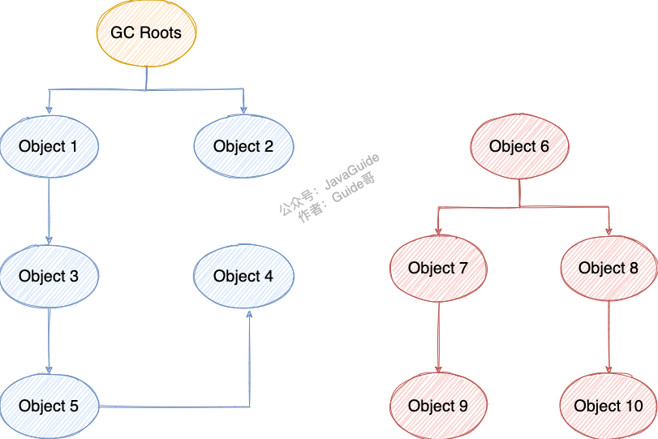

	

JDK 1.8，从PermGen永久代，到Metaspace元空间

主要的不同之处就在于，元空间使用的是本地内存，而不再是JVM内存。


# **线程私有**


### **程序计数器**

用于读取指令，控制代码流程：顺序，循环，异常处理

保存当前线程执行的位置


### **虚拟机栈**

压入栈帧，栈帧中包括局部变量等信息；栈帧随着方法调用而创建，随着方法结束而销毁。

	


常见错误信息

1. `StackOverFlowError`：栈不允许动态扩展，且请求栈深度超过JVM最大栈深度，栈溢出。
2. `OutOfMemoryError`：栈允许动态扩展时，但JVM无法为栈申请到更多内存了，OOM。


### **本地方法栈**

与虚拟机栈类似，用于执行Native方法。在HotSpot虚拟机中和虚拟机栈合二为一。


# **线程共享**


### **堆**

存放对象实例&数组，是垃圾收集器管理的主要区域，也称为GC堆。

如果根据垃圾收集器的回收方法，还可以细分为Eden，Survivor，Old等空间。

	

对象首先在分配在Eden中，第一次YoungGC如果还存活，则放入S0或S1中，并从1岁开始增长年龄；直到一定年龄（默认15岁）后，被晋升到老年代中。


常见错误信息

1. `java.lang.OutOfMemoryError: GC Overhead Limit Exceeded`：JVM花很多时间GC，但却只回收很少的堆空间，报错。

2. `java.lang.OutOfMemoryError: Java heap space`：创建对象时，堆中内存不足，无法存放新对象。

   可以通过`-Xmx`配置最大堆内存。


### **方法区**

方法区会存储已被虚拟机加载的 **类信息、字段信息、方法信息、常量、静态变量、即时编译器编译后的代码缓存等数据**。


可以将永久代和元空间视为方法去的两种实现方式

为什么将永久代（PermGen）替换为元空间（MetaSpace）？

1. 元空间使用直接内存，受限于本机，溢出概率小。

   可以通过`-XX：MaxMetaspaceSize`配置，默认unlimited

   > 当元空间溢出时会得到如下错误： `java.lang.OutOfMemoryError: MetaSpace`

2. 可以加载更多类的元数据

3. JDK8中，HotSpot和JRockit合并代码，由于JRokit从来没有永久代这个东西，合并起来也省事了。


### 运行时常量池

Class 文件中除了有类的版本、字段、方法、接口等描述信息外，还有用于存放编译期生成的各种字面量（Literal）和符号引用（Symbolic Reference）的 **常量池表(Constant Pool Table)** 。

常量池表会在类加载后存放到方法区的运行时常量池中。


### 字符串常量池

为了提高对于String类型对象的性能和内存消耗，避免字符串的重复创建。

1.7后从永久代移动到堆中。永久代（方法区实现）的GC效率低，只有Full GC时才会回收；而Java程序通常存在大量需要回收的String，放到堆中使其能够被及时回收。


### **直接内存**

非JVM运行时数据的一部分，不收堆大小的限制。

但既然是内存，还是受到本机总内存大小的限制。


# HotSpot虚拟机 对象


### 对象创建

1. 类加载检查：遇到new指令，检查该类是否已经被加载过；如果内有，先加载响应的类

2. 分配内存

   - 指针碰撞：堆规整情况下，使用过的堆内存与没有使用过的内存中间，有一个分界指针，挪动指针即分配空间
   - 空闲列表：堆内存不规整，使用列表找到一块足够大的空间，分配给对象并更新列表

   内存是否规整？取决于GC算法是“标记-清楚”还是“标记-整理”

   多线程并发分配空间

   - CAS+失败重试
   - TLAB：为每个线程在Eden预留空间，用完后再CAS

3. 初始化零值（不包括对象头）

4. 设置对象头：对象属于的类，对象的哈希码，GC分代年龄。

   根据虚拟机当前状态，如是否启用偏向锁，对象头会有不同的设置方式。

5. 执行<init>方法

   将零值的部分，按照程序进行初始化


### 对象内存布局

对象头

1. 运行时数据：哈希码，GC分代年龄，锁状态标志等等
2. 类型指针：指向类元数据，JVM用该指针判断对象所属的类

实例数据：各种类型的字段内容

对其填充：对象大小为8字节的倍数，填充部分仅仅起到占位作用。

https://cloud.tencent.com/developer/article/1415034


### 对象访问定位

句柄：reference指向句柄池中的句柄，句柄包含对象实例指针&类型指针；优势：实例被回收时，不用改动关联的所有reference，改变句柄指针即可。

直接指针：reference存放对象指针，对象指针中包含类型指针；优势：节省一次指针定位，快！


# 垃圾回收


### 回收原则

大对象直接进入老年代：减少频繁复制带来的开销

长期存活的对象将进入老年代：对象出生在Eden，第一次Young GC没有被回收，则进入Servivor并将age置于1，当age到达一定阈值时，进入Old


1. 部分回收 Partial GC
   - Minor GC / Young GC：对Eden & Servivor进行回收
   - Major GC / Old GC：对Old进行回收
   - Mixed GC：对整个Young，和部分Old进行回收
2. 整堆收集 Full GC


### 死亡对象判断方法


**引用计数法**

每多一个引用+1，引用失效-1，计数器为0代表对象不可能再被使用。

实现简单，效率高，但主流JVM并没有采用，因为难以解决循环引用问题。

```java
public class ReferenceCountingGc {
    Object instance = null;
    public static void main(String[] args) {
        ReferenceCountingGc objA = new ReferenceCountingGc();
        ReferenceCountingGc objB = new ReferenceCountingGc();
        objA.instance = objB;
        objB.instance = objA;
        objA = null;
        objB = null;
    }
}
```


**可达性分析算法**

以一系列成为“GC Roots”的对象作为起点，向下搜索引用链，当一个对象没有存在于任何引用链上时，证明该对象不可用，需要被回收。

	

可以作为GC Roots的对象

- 虚拟机栈（栈帧中的变量表）引用的对象

- 本地方法栈引用的对象

- 方法区中，类静态属性引用的对象

- 所有被持有同步锁的对象（Object held as synchronization monitor)

- 运行中的Java Thread对象

  

**引用类型**

1. 强引用，最普遍的引用，不可回收
2. 软引用，可有可无，内存不足时直接回收
3. 弱引用，可有可无，随时可以直接回收
4. 虚引用，JVM将在对象被回收后，将其加入queue，我们可以通过建立虚引用，判断对象是否被回收，代替finalize()使用

Soft和Weak都可以配合ReferenceQueue联合使用，用于判断对象是否被回收；而虚引用必须与ReferenceQueue联合使用


**方法区回收**

方法区主要回收无用的类

虚拟机“可以”对满足一下3个条件的无用类，进行回收

1. 所有实例已经被回收
2. ClassLoader被回收
3. Class对象没有被引用（没有任何地方可以通过反射访问该类）


### 垃圾收集算法


**标记-清除**

效率低，清除后产生大量碎片


**标记-复制**

将内存分为两份，每次在一块内存中清理完对象，将存活的复制到另一块中。

适合存活几率低的Young区


**标记-整理**

在标记清除的基础上，让存活对象向一端对齐

适合存活几率高的Old区

	


### 垃圾收集器

对于垃圾回收方法的具体实现


**Serial收集器**

单线程STW


**ParNew收集器**

Serial收集器的多线程并发版本

Young采用标记-复制，Old采用标记-整理


**CMS收集器**

Concurrent Mark Sweep，以最短停顿时间为目的

达到垃圾收集线程&用户线程（基本上）同时工作的效果

采用标记-清除算法

	


**G1收集器**

没有采用分代的空间设计，但是沿用了分代的概念

将堆内存分为Region


# 类加载


### 类加载过程

1. 加载

   - 获取类的二进制流（从ZIP，JAR，WAR中）
   - 将类信息加载到方法区
   - 内存中生成该类的Class对象，作为访问该类方法区的入口

   > 数组类型不通过类加载器创建，它由 Java 虚拟机直接创建。

2. 验证

   - Class文件格式是否合法
   - 字节码语义是否合法（是否符合Java语法规范）
   - 字节码验证（程序流程&逻辑是否合法）
   - 符号引用验证

3. 准备：为类变量（静态变量）分配内存，并设置变量初始值

4. 解析：将字段&方法的符号引用，替换为直接引用（直接指向**方法区中**的方法&常量的指针）

5. 初始化：执行类的静态代码

   什么时候初始化？

   - 初次调用一个类的静态方法/变量时（构造方法也算静态方法）
   - 反射调用时，如Class.forName()
   - 虚拟机启动时，包含main()方法的主类首先初始化

6. 使用

7. 卸载：Class对象被GC，方法区数据删除

   卸载需要满足的条件

   - 堆中不存在实例对象
   - 类没有在其他地方被引用
   - 类加载器已被GC


### **双亲委派**

The Java platform uses a delegation model for loading classes. **The basic idea is that every class loader has a "parent" class loader.** When loading a class, a class loader first "delegates" the search for the class to its parent class loader before attempting to find the class itself.

避免了类的重复加载，保证了Java核心API不被篡改。