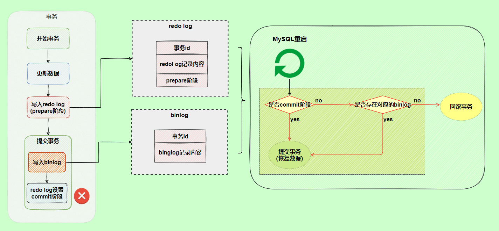

### 基础架构

	

> MySQL 8.0 版本后移除查询缓存

### 存储引擎

MySQL 存储引擎采用的是插件式架构，不同的数据库表可以采用不同的存储引擎。

MySQL 5.5.5 之前，MyISAM 是 MySQL 的默认存储引擎。5.5.5 版本之后，InnoDB 是 MySQL 的默认存储引擎。

**MyISAM & InnoDB**

- MyISAM不支持行级锁，要锁直接锁整个表，并发不友好
- MyISAM不支持事务，也没有MVCC
- MyISAM不支持外键
- MyISAM不支持崩溃恢复，InnoDB有redo log
- MyISAM的B+树索引和数据分离，InnoDB索引即数据

结论：几乎没有什么理由去选择MyISAM作为存储引擎

### MySQL事务

一组操作，要么都执行，要么都不执行

**ACID**

原子性Atomicity：事务是最小执行单位，不可分割

一致性Consistency：执行事务前后，数据保持一致性（如：转账前后付款人+收款人的钱总和不变，不会出现任何BUG）

隔离性Isolation：并发访问时，事务互不干扰

持久性Durability：事务提交后，数据的改变是永久的，数据库崩溃也不会改变这个事实。

> **数据库只有保证了原子性，隔离性和持久性后，应用程序才能达到逻辑上的数据一致性。所以C是目的，A & I & D是手段。**

**并发事务导致的问题**

- 脏读Dirty read：在一个事务中，读到其他事务还没有commit的数据
- 丢失修改Lost to modify：
- 不可重复读Unrepeatable read：一次事务中，多次读取同一个数据，由于其他事务的修改&commit，读到不同的结果。
- 幻读Phantom read：和不可重复读类似，只不过是读到了一些原本不存在的数据

不可重复读和幻读的区别：一个是值不同，一个是数据量不同

**隔离级别**

- 读未提交READ-UNCOMMITTED：不解决任何问题
- 读已提交READ-COMMITTED：解决了脏读问题
- 可重复读REPEATABLE-READ：解决了不可重复读问题
- 串行化SERIALIZABLE：因为不支持并发，所以直接解决了所有问题

**幻读导致的问题**

事务A：

1. select * from table where number = 5 for update;
2. update table set number = 100 where number = 5;
3. 等待事务B提交后再提交

事务B：

1. insert into table (id,number) values(100,5)
2. 提交

这时候，由于STATEMENT格式的binlog是直接写入SQL的，数据库和LOG中的数据会不一致。

LOG的顺序

1. 事务B insert
2. 事务A update

导致本不应该被一起update的（100，5）也被update为（100，100）

> 经过实验，MySQL是不允许READ COMMITTED or READ UNCOMMITTED + BINLOG_FORMAT = STATEMENT这个组合的。可以使用ROW格式的binlog，写入的就是数据改变的event。

解决该问题的两种方法

1. READ COMMITTED  + ROW

   > ROW格式的LOG，使用base-64加密了数据更改event，通过mysqlbinlog -v log_file就可以读了！

2. REPEATABLE-READ + 默认的MVCC & Next-key Lock

   > 当前读的情况下，间歇锁+行锁合成Next-key Lock，前开后闭。比如防止5-10这个区间，间歇锁锁住(5,10)，行锁锁住10，加一起为(5,10]

在READ COMMITTED中，由于没有锁而且每次读都是一次新的快照，所以无法避免幻读；为了解决幻读导致的问题，使用ROW格式的binlog来保证数据一致性。

在REPEATABLE-READ中，当前读for update会直接锁住该上锁的行和间隙，不让其他事务写入，符合语义，保证不出现幻读；快照读中，自然就使用MVCC，来保证不出现幻读。

**索引**

聚集索引：主键索引，叶子节点存储所有数据

非聚集索引：叶子节点存储该索引值，以及主键值，可能需要二次回表查询（根据主键，去聚集索引查找）；如果查找的数据就是该索引的值，则不需要回表，这种操作成为“覆盖索引”

应该为频繁作为WHERE查询条件，和JOIN ON连接条件的字段，建立索引。

谨慎为频繁更新的字段建立索引。

**日志**

binlog：MySQL服务器提供，用于备份数据库，解析并恢复数据库。分为STATEMENT和ROW两种模式（也可以MIXED），STATEMENT记录SQL，而ROW记录更具体的更改时间点和更改（为了保证数据一致性）。

redo log：InnoDB引擎提供，标准的WAL。服务器崩溃，重启时，InooDB引擎使用redo log来恢复数据。该日志记录的是物理值，而不是逻辑语句，所以是幂等的。

> 拥有write pos和checkpoint两个重要属性，分别为写入点和持久化点，其中间的部分可以用于写入新的redo log，如果满了，就需要先刷盘将checkpoint后移。
>
> 	

为了保证binlog和redo log的一致性，InnoDB引擎采用两阶段提交，将redo log拆分成prepare和commit两个阶段。

undo log：用于回滚数据，且MVCC就是由该log实现。InnoDB通过DB_TRX_ID和 Read View判断数据可见性，如果不可见，就通过指针寻找undo log中的历史版本。