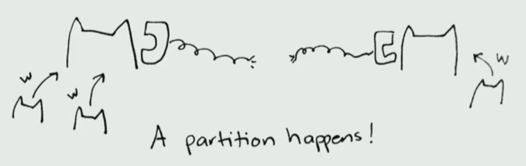

### CAP & BASE


**CAP定理**

- （Strong）Consistency一致性：所有节点访问，均同时读到最新写入的值

- Availability可用性：所有请求得到非Error返回值，但不保证该值为最新。

- Partition tolerance分区容错性：当一些网络通信出现问题时（本身在一个网络中的两个Node，被分开且无法联系到对方），系统依然可以运转。

  	


CAP并不是3选2问题！	

当P出现问题时（这里的partition指得并不是数据分割，或者failed node，而是两个running nodes中间的网络出现问题，导致通讯被中断），系统要决定保证C或A

当P没有问题时，系统要同时保证C和A

为什么会出现Network partitionss（硬件损坏，软件出现奇怪行为，GC STW，网络故障）

1. 继续读写，但是因为网络原因，一致性无法保证（比如在leader-follower的选举中，两边都选了一个leader，也叫split brain）
2. 暂停一端的读写，直到网络恢复正常，可用性受到影响

	


**演讲：为什么分布式系统很难？**

https://www.youtube.com/watch?v=uTJvMRR40Ag


更多的数据，更多对数据的需求，云计算的进步。

我们可以Vertically增加单个机器的性能；也可以Horizontally获得更多的机器来执行任务，又称分布式。

分布式的好处

- Scalability：可以无限扩充新的机器
- Availability：一个机器down，另一个机器继续执行
- Latency：地理位置就近选择


”shared nothing“ architecture：一个机器的CPU只能被它自己使用。

导致我们只能通过网络通讯，在分布式中使用其他机器的CPU，but the network is unreliable。

拜占庭问题，两个将军，只能靠中间不靠谱的传话人来通讯。


**BASE理论**

CAP的延申，对AP方案的补充

- Basically Available（基本可用）：面对不可预知的故障（访问量剧增），允许响应时间的损失&部分非核心功能的不可用
- Soft-state（软状态）：允许不同节点在同步数据副本的过程中，出现延迟
- Eventually Consistent（最终一致性）：在经过一段时间后，达到一致性


### 网关

Why：不同的服务部署在不同的机器，网关帮我们转发请求，做安全验证，负载均衡，容灾监控...

What：请求到达服务前的过滤

How：


### 分布式ID

Why：单机MySQL撑不住的情况下，需要分库分表，但多个数据库都存放有订单Table，需要保证他们的主键ID不重复。

What：分布式系统下，对数据的唯一标识

How

1. 通过数据库的一张主键自增表，该表只包括自增id和一个唯一索引column。

   通过REPLACE INTO，如果value重复，就删除重复的row并插入

   ```sql
   CREATE TABLE `sequence_id` (
     `id` bigint(20) unsigned NOT NULL AUTO_INCREMENT,
     `stub` char(10) NOT NULL DEFAULT '',
     PRIMARY KEY (`id`),
     UNIQUE KEY `stub` (`stub`)
   ) ENGINE=InnoDB DEFAULT CHARSET=utf8mb4;
   ```

   

   ```sql
   BEGIN;
   REPLACE INTO sequence_id (stub) VALUES ('stub');
   SELECT LAST_INSERT_ID();
   COMMIT;
   ```

2. 在数据库中使用分段的方式，预先获取一系列id

   ```sql
   CREATE TABLE `sequence_id_generator` (
     `id` int(10) NOT NULL,
     `current_max_id` bigint(20) NOT NULL COMMENT '当前最大id',
     `step` int(10) NOT NULL COMMENT '号段的长度',
     `version` int(20) NOT NULL COMMENT '版本号',
     `biz_type`    int(20) NOT NULL COMMENT '业务类型',
      PRIMARY KEY (`id`)
   ) ENGINE=InnoDB DEFAULT CHARSET=utf8mb4;
   ```

   每次使用update一下

   ```sql
   UPDATE sequence_id_generator SET current_max_id = 0+100, version=version+1 WHERE version = 0  AND `biz_type` = 101
   SELECT `current_max_id`, `step`,`version` FROM `sequence_id_generator` where `biz_type` = 101
   ```

3. NoSQL

   通过Redis的incr，实现对id的原子顺序递增

4. UUID

5. Snowflake雪花算法


### RPC

WHY：分布式后台中，一个服务想要调取在另一台机器上的服务，比较复杂；我们想让这个过程像在调用本地方法一样简单

WHAT：Remote Procedure Call，远程调用。

HOW

1. 服务消费端以（client）以本地调用的方式，调用远程服务
2. client stub，接收到调用后，将方法和参数封装成Request，并找到远程服务的地址，发出
3. 服务端stub将Request反序列化为Java对象，并根据Request中的类&方法&参数，调用本地你方法，最终将方法执行结果封装到Response中返回
4. client将Response反序列化为Java对象，获取其中的返回值

	