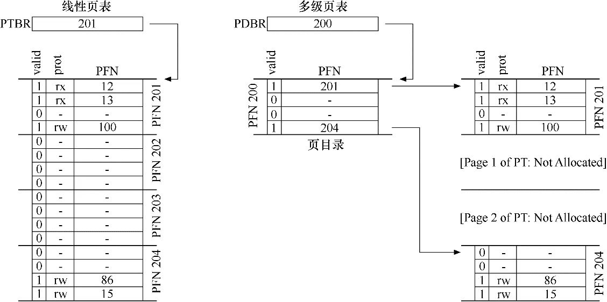

### 进程 & 线程

定义：进程是一个运行中的程序，可以拥有一个或  线程

进程统一申请共享空间，供线程使用，且作为独立的程序来隔离（无法随便被别的进程篡改数据）

线程作为系统调用的单位，拥有自己的程序计数器PC和栈

进程&线程状态：new -> ready -> running -> waiting -> termminated

线程同步的方式

1. 互斥量Mutex，同一时间只允许一个线程访问
2. 信号量Semaphore，同一时刻允许多个线程访问
3. 时间Event，通过Wait&Notify等待和唤醒其他线程

**进程调度算法**

- 普通队列FCFS
- 短任务优先SJF：对普通队列的优化，短任务先执行完毕，提高周转时间（完成时间 - 到达时间）
- 时间片轮转RR：提高响应速度，避免饿死
- 多级反馈队列MLFQ：既优先执行短任务，又可以对所有任务做出快速响应
- 步长Stride：给每个任务分配步长，当前走的最短的任务可以一直按照它的步长走（运行），直到它不再是走的最短的那个任务

[LINUX调度算法]: ../操作系统/调度算法.md

**死锁**

多个线程同时无限期阻塞，等待资源释放

必要条件

1. 互斥：非共享资源
2. 占有并等待：一个线程持有资源，同时等待资源
3. 非抢占：资源不能被抢占
4. 循环等待：有一组循环等待的线程

解决方法

1. 静态分配：线程先拿到所有需要的锁再执行任务，所以要么持有所有，要么完全不持有资源。就不会占有并等待了。
2. 层次分配：所有线程必须遵循先持有A再持有B的规则。就不会循环等待了。
3. 检测出死锁后试图解除（主动放弃资源/主动抢占资源）

### 内存管理

操作系统提供分配malloc，回收free，地址转换等功能，帮助我们更好的使用内存空间。

**内存管理机制**

1. 块式管理：远古时期，将内存分为固定大小的块，每块只包含一个进程。

   > 内部碎片：已分配的空间中，有未使用的空间，造成浪费

2. 段式管理：将内存分为一段一段的，并赋予意义，例如主程序段MAIN，数据段D，栈段S

   > 外部碎片：物理内存充满断断续续的空闲时间，很难分配给新的段

3. **页式管理：将内存分为大小相等且固定的页，页较小，减少碎片，通过页表映射逻辑地址&物理地址**

   > **页表项PTE（Page Table Entry）：操作系统为每个进程保存的数据结构，用来将虚拟地址（虚拟页面号+页内偏移量）转换为物理地址**

4. 段页式：

**更小的页表**

多级页表&段页式存储都是想要解决线性页表带来的页表浪费。

段页式：先分段，再分页，试图通过给每个段分配一张页表，来减少页浪费；但由于依赖于分段（每个段一张页表），如果是一个大而稀疏的堆，依然可以导致页表浪费。

多级页表：先去页目录PDE（Page Directory Entry）找页表，再去页表中找页；页表空间与正在使用的地址空间成正比（Invalid的页表不会被初始化出来），支持稀疏的地址空间（不用分配一个很大的连续空间来存储页）

	

	

**TLB**

处于CPU附近，作为缓存访问速度很快；大量的TLB未命中是很致命的！

高速缓存的实现，背后的思想是局部性Locality

时间局部性：最近访问的指令很快会再次访问

空间局部性：程序访问地址x时，可能很快会访问临近x的内存

TLB未命中时，硬件系统会抛出异常，交给内核处理（检查valid，访问内存中的页表，将映射更新至TLB），从陷阱返回后硬件会重试该指令（导致TLB命中）

在使用多级页表时，TLB未命中会导致2次额外的内存加载（一次用于页目录，另一个用于PTE）

**超越物理内存**

交换空间swap space：才硬盘上开辟的，用于物理页移入移出的空间。

页错误page fault：TLB未命中 -> 查找PTE的存在位（present bit）为0 -> 页不在内存，而在硬盘上，报页错误。通常使用PTE的某些位来保存硬盘存储地址，缺页时将请求发送到硬盘，将页读取到内存中。

页面置换算法page-replacement policy

- OPT最佳页面置换算法：无法实现，用来作对比
- 随机置换

- FIFO
- LRU（Least Recently Used）
- LFU（Least Frequently Used）

### Linux

一切皆文件

**inode**

索引节点（index + node）inode：用来维护某个文件被分成几块、每一块在的地址、文件拥有者，创建时间，权限，大小等信息。

块block ：实际文件的内容，如果一个文件大于一个块时候，那么将占用多个 block，但是一个块只能存放一个文件。（由inode指向）

使用`stat`查看文件的inode信息