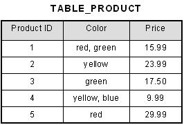
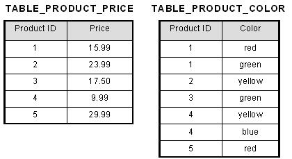
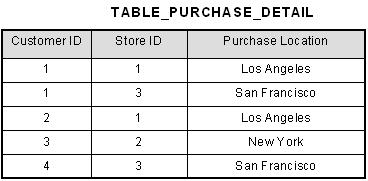
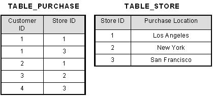
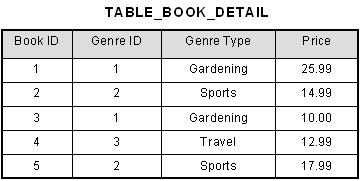
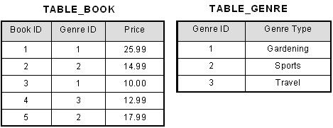

### 数据库范式

**1NF第一范式**

每个字段对应一个值，不可再拆分

将Color字段拆分成单独的表，然后可以通过第三张表完成多对多的连接

	

	

**2NF第二范式**

满足1NF的情况下，避免非主键字段对主键的**部分依赖**

部份依赖的情况可能只出现于复合主键（多个字段作为主键），而某个字段只依赖其中一个主键。

在复合主键[Customer ID，Store ID]的情况下，Purchase Location只依赖于Store ID，所以是部份依赖。应该将其拆出来，单独依赖于Store ID这个主键。

	

	

**3NF第三范式**

满足2NF的情况下，避免非主键字段值对主键没有**直接依赖**

[Book ID]决定了[Genre ID]，然后[Gener ID]决定了[Gener Type]，所以[Book ID]是通过[Genre ID]才能决定[Genre Type]的，也可以说[Genre Type]直接依赖于[Genre ID]而不是[Book ID]。

所以将其拆分成直接依赖于主键的表，使得所有非主键字段都直接依赖于主键。

	

	

### 字符集

编码：将字符编码成二进制格式

解码：将二进制串解码为字符

如果编码&解码不一致，或者该字符不存在于字符集中，则会出现乱码/报错等现象。

MySQL 字符编码集中有两套 UTF-8 编码实现：

- **`utf8`** ： `utf8`编码只支持`1-3`个字节 。 在 `utf8` 编码中，中文是占 3 个字节，其他数字、英文、符号占一个字节。但 emoji 符号占 4 个字节，一些较复杂的文字、繁体字也是 4 个字节。
- **`utf8mb4`** ： UTF-8 的完整实现，正版！最多支持使用 4 个字节表示字符，因此，可以用来存储 emoji 符号。