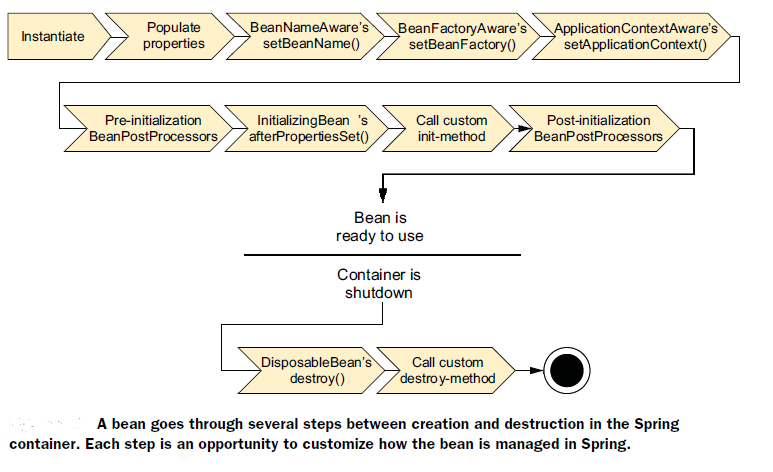

坚韧，喜欢琢磨&有充分的好奇心，喜欢coding特别是算法部分，喜欢和优秀的人一起合作，喜欢做比较充足的准备

代理模式在Spring的应用：AOP，JPA中的Repository代理

Redis的实现（字符串ASCII int | sds，列表ziplist&linkedlist，哈希ziplist&dict，集合dict&intset，有序集合ziplist&（dict + skiplist）），扩容方式（dict字典采用渐进式hash，sds动态扩容）

线程安全容器：ConcurrentHashMap，CopyOnWriteArrayList，BlockingQueue，ConcurrentLinkedQueue（非阻塞，CAS），ConcurrentSkipListMap（使用跳表来实现的map）

线程安全的方式：synchronized，显示的lock，immutable不可变类

进程&线程：进程=运行中的程序，向操作系统申请内存空间&文件句柄；线程=一个进程中可以有多个线程，也是操作系统进行调度的基本代为；线程的创建和线程间的调度消耗少，而进程间的消耗大，因为tlb页表缓冲 miss和其他cache miss

Exception & Error：Throwable子类，Error为一些不应该出现的非正常现象，如JVM的OOM和ThreadDeath；Exception大多为我们程序员自定义的逻辑异常，受检&非受检

JDK8新特性：接口可以添加default默认方法；支持lambda表达式 & 函数式接口（只有一个方法的接口）；新增Optional类，包装结果，防止空指针；Stream流，初始化+中间操作+最终操作，链式的易读的去操作集合类；新增很多时间类，如LocalDateTime；CompletableFuture进行异步链式编程；多注解。

垃圾回收：内存分为Eden，Servivor，Old；算法：标记-清除、复制、整理；标记gc root，并发标记存活对象，重新标记，并发清理；再尽可能减少STW时间下，进行高效垃圾回收

GCRoot（方法区中类静态变量引用的对象，虚拟机栈中的本地变量引用的对象，还有被持有锁的对象）

JDK监控命令：jps查看所有Java进程；jstat查看JVM运行时数据；jinfo实时查看虚拟机参数；jmap&jhat生成堆快照；jstack生成线程快照，用于定位死锁

半导体测试系统很有名

反问：软件开发部门业务是什么样的，使用的技术&框架；

key-value server, test状态通过grpc协议转发给访问的人，scala，通信有的GRPC。

软件测试方式：黑盒（不知道内部结构，穷举input）&白盒（知道内部逻辑，穷举路径）；手动&自动；单元测试（最小功能的测试，其他都是预设好的）&集成测试（验证多个具有依赖关系的功能）；非功能的性能测试

### 并发

- [ ] AQS和各种基于其实现的锁（volatile value + 双向链表，ReentrantLock，CountdownLatch，Semaphore，CyclicBarrier)
- [ ] Volatile作用 （通过插入内存屏障禁止指令重排&主存读写保证变量的可见性）

### JVM

- [ ] 类加载（加载，验证，类变量分配内存&设置初始值，解析，初始化）
- [ ] 双亲委派（避免了类的重复加载，保证了Java核心API不被篡改。）
- [ ] GCRoot（方法区中类静态变量引用的对象，虚拟机栈中的本地变量引用的对象，还有被持有锁的对象）

### MySQL

- [ ] MyISAM & InnoDB（无行锁，无事务，无外键，无redo log的崩溃恢复，B+树索引和数据分离）
- [ ] 事务 & 它的ACID特性（atomic，consistency，isolation，durability）, WAL
- [ ] 并发导致的问题 & 隔离性解决的问题（脏读，不可重复读，幻读；ru,rc,rr,串行化）

### Redis

- [ ] 常用数据结构&实现（字符串ASCII int | sds，列表ziplist&linkedlist，哈希ziplist&dict，集合dict&intset，有序集合ziplist&（dict + skiplist））
- [ ] 持久化（RDB保存数据中的键值对，自定义执行时机；AOF将每次执行的命令持久化，宕机时优先使用）

### Spring

- [ ] 生命周期（实例化，各种aware，postprocesssor，initmethod，destroy
- [ ] 事务&事务传播（required，required-new，nested，mandatory）

### 计算机网络

- [ ] HTTP 1.0 vs HTTP 1.1（默认长连接，加入大量状态码，增加缓存策略if-unmodified-since, if-match，可以加上range header请求某个对象的一部分，请求头中加入包含Host头的主机名）
- [ ] HTTP状态码（200 OK，201 Created，202 Accepted，204 No content；301 Permantely，302 Found，400 Bad Request，401 Unauthorized，403 Forbidden，404 Not Found，409 Conflict，500 Server Error，502 Bad Gateway）
- [ ] TCP & UDP（校验和，超时重传，流量控制-交流窗口，拥塞控制-根据网络传输速度）

### 操作系统

- [ ] 进程调度算法（FIFO，SJF，MLFQ（O1 scheduler 优先级高时间片少，优先级低时间片多），CFS & BFS基于步长算法（先执行值最小的任务，然后增加其值，以公平为主）
- [ ] 文件管理（磁盘中，超级快&Inode Bitmap&Data Bitmap&Inode块&剩下的都存放数据）

### RabbitMQ

- [ ] 特点（可靠，高可用，支持多种网络协议，跨语言，管理界面，提供许多插件）
- [ ] AMQP（Type：Method，Content Header，Content Body（这两个只有Type为Publish|Consume时出现））主要组件就是Exchange，Queue，Binding规则
- [ ] Exchange（Direct，Fanout，Topic）多Consumer时按顺序分发任务
- [ ] 死信队列（消息被拒绝，消息TTL过期，队列满了）
- [ ] 消息的可靠传递（Ack机制）
- [ ] 消息去重（Publish时给header中定义全球唯一ID，Consume时最好使操作幂等，不行的话就根据Message中的redelivered flag，加上全球ID去查是否处理过）
- [ ] 高可用（镜像模式，每个节点平等，互相同步数据）

java后端，angular前端；

更多基础架构，springboot/springcloud，正在做技术归一整理，拆分微服务，redhat + openshift + docker

esteal，服务治理service-mash，redis缓存，messaging用kafka，数据仓库做报表来源，如何管理大文件

微前端，iframe -> 不同的页面不一样，业务驱动；花旗软件20年，只为内部服务，接内部需求。

java体系，mysql，es，redis，搜索类的引进oss，spring为基础的微服务

核心都是来自阿里，美团。

未来规划，深入后端，走全栈，或者在几年后转到区块链开发；但是会在上海呆至少5年

花旗全球职能技术部**Global Functions Technology （GFT）**

负责为整个花旗集团提供风险管理、资本规划、财务规划和分析、信息安全、合规性指标、监管、审计、评估等职能的技术开发与支持。充分利用大数据和云计算的技术，为花旗各项业务的顺利开展保驾护航。

因为是面向银行的一些业务和开发，开发环境是使用内网吗，还是可以使用外网~

我非常向往去花旗工作，但是因为我走的通道是外包的路径，想向您询问一下咱们部门每年外包转正的机会高不高，这个对我未来的职业道路也会有一定影响

每个月都会有同事转正，比例蛮高

摘要

哈希冲突的值

error_out standard_in standard_out

知识型技能，灵活办公和就业

一家日企（技术选型），还有一个线上办公小公司（小公司对于我的稳定性）

是否有租房补贴，交通补贴，加班费，餐补房补车补

是否有试用期

五险一金什么时候开始交，薪资发放时间，是否需要打卡上下班

所属部门是不是gfts

发薪时间

团建和年会等活动我们跟奥解斯还是花旗

入职时间

offer细节

外派到正岗，转正GFT，风险把控，报表，公司收益；业务广泛性比较大，容易跳槽；

19年从印度换回中国，大量上升空间，正岗10个2个外派，正常情况下1年转正。

19k*13，20比较理想

13薪，满13个月；转正后13薪也会照样给；

社保和公积金都按照薪资2w缴纳；补充医疗保险；

3年的劳动合同，外派

年假14天，每年清空；福利中秋和春节（礼品礼券）

统一体检

出游和480元补贴，有的业务部门760

内外部培训都是线上统一培训，不影响工作都可以参加

足球篮球场地租借，年轻人多，平均年龄26，27岁

朝九晚六，双休

不包含补贴，可能有餐补&交通&（加班申请还可以调休）

只有公共节假日加班，提供加班费，平时没有；GFT加班不多

花旗花木办公室，

### 流程

签字

申请批工资，这两天给offer，

正版软硬件安装7天

110108199810282234，去section check检查是否有犯罪记录

第三方背调，工作经验（拉一个社保记录）

您好，我还想最后了解一下公司的结构，主要是人数和层次如果您了解的话；还有我现在有可能知道入职后所在的组吗？

每一个老板手底下分批的，两个组，我这边在固定收益信贷小组，10个人，信贷收益系统的Java开发，培训期间定位

组长，manager，boss

20k*13（17.5缴纳金）

我对公司的结构认识：给自由工作者和希望达到灵活应聘的企业提供的平台，工作者提供技术（设计，文案，编程）

双方收益：自由工作者可以达到理想的目标，远程办公+时间灵活；企业可以在不需要长期维护一个合同的情况下也能在有需要的时候招聘到合适的人来完成工作。

对于小微企业，灵活招聘的需求比较大，管理扁平化，可以为了解决一项目标而短期聘用/租赁一个人。

FIVERR，纽交所上市；设计，文本，视频动画，音乐音频，编程，商业PB，甚至游戏教练

一个软件一旦完成开发，都有机会通过互联网的告诉传播人尽皆知，甚至改变人们的生活方式，您认为能使圆领成为现象及应用的关键是什么？

十年二十年，2003年特斯拉，做未来的事，；不知道什么是对的

对于企业在两三年内的发展目标，比如企业的规模和用户数量的预期

不是很关心，两三内默默无闻，

最近的季度，方向清楚，0-1完成，未来2-3年

3天办公室，2天居家

FINIA先别填

