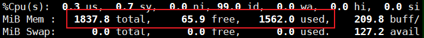
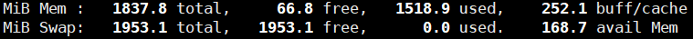
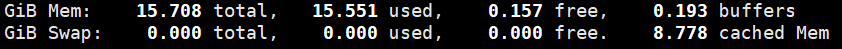

### 2022/3/28

**功能性需求**

1. 选择urls
2. fetcher去指定url的html文件中拿所需的数据
3. 将数据保存到数据库中


**注意事项**

- 通过网站中的robots.txt file，检查是否允许爬取


**选择爬取目标**

丝芙兰：爬取困难，都是使用JS完成的动态页面；且口红名字皆为英文，不是优先需要的信息。

挑选出3个品牌官网，使用Jousp试着去爬取到一些信息

https://www.maccosmetics.com.cn/products/13854

https://www.yslbeautycn.com/makeup-lips-and-nails

https://www.giorgioarmanibeauty.cn/LIPS


### 2022/3/29

**统一爬虫接口，Fetcher Interface**

- fetch()
- getBrandName() --> 用于Spring的策略模式

因为每个Brand的爬取方式都不太一样，实现类为{BrandName}Fetcher


**确定口红的基本属性**

口红作为一个Entity

- 名字
- 价格
- 图片
- 色号 (名字，RGB) --> 一对多，色号作为一个Entity
- 品牌（名字，官网）--> 多对一，品牌作为一个Entity


### 2022/3/30

docker建立口红数据库(开发环境)，Navicat远程连接，使用JPA将爬虫信息输入数据库

docker run --name lipstick-mysql -e MYSQL_ROOT_PASSWORD={PASSWORD} -p 3306:3306 -d mysql 


**解决Armani爬取问题**

Armani网页是动态JS加载的，所以不能使用Jsoup直接获取静态HTML网页。

使用HtmlUnit，开启JS支持，等待JS加载完毕后，拿到HTML，再交给Jsoup解析。

​                 

**优化fetch()方法执行过程**

1. 获取document --> 可封装
2. 获取包含每个口红div的list
3. 遍历list，从中获取口红信息(产品名字，价格，背景图) --> 可封装
4. 获取口红的颜色栏，再遍历每个颜色(Hex rgb，色号名字) --> 可封装
5. 将口红色号加入当前口红(调用addColor方法，互相添加依赖)


**通过brandName获取Fethcer类**

Map + 策略模式

```java
@Component
public class FetcherFactory {

    private final Map<String, Fetcher> fetcherMap;

    public FetcherFactory(List<Fetcher> fetcherList) {
        fetcherMap = new HashMap<>();
        for(var fetcher : fetcherList){
            fetcherMap.put(fetcher.getBrandName(),fetcher);
        }
    }

    public Fetcher getFetcher(String brandName){
        return fetcherMap.get(brandName);
    }
}
```


### 2022/3/31

完成3个品牌从爬虫到数据库的存储

完成口红产品的存储和获取接口。


**JPA通过foreign key查询，出现JSON循环解析**

解决方法：@JsonManagedReference and @JsonBackReference


**HtmlUnit日志过多**

解决方法：YAML设置关闭即可，毕竟它的日志打印也是依赖于common-log的

```yaml
logging:
  level:
    root: info
    com:
      gargoylesoftware: off
```


### 2022/4/1

使用@ControllerAdvice统一异常处理

享受清明假期~


### 2022/4/6

**建立前端项目并**

使用React作为JS框架（使用functional component和hook的搭配）

https://reactjs.org/

使用tailwindcss作为CSS框架（utility first，快速上手）

https://tailwindcss.com/

使用React Router v6完成前端路由

https://reactrouter.com/docs/en/v6

v5到v6的变动：https://betterprogramming.pub/whats-new-in-react-router-v6-31930f4aae4c


**完成简单的首页绘制**


**git管理**

前后端项目使用git管理版本，并上传github。

等全部完成后，将密码等信息保护起来，并开源。


### 2022/4/7

**使用axios发送REST请求**

https://axios-http.com/

axios.create()设置BaseUrl，然后调用get()方法从后端拿信息

使用map()将data渲染为dom，完成品牌界面和口红界面的显示。


**爬虫bug**

YSL官网爬虫图片为Loading...，需要等JS加载。

但使用HtmlUnit等待JS渲染会报bug，解决不了，暂时不管了。


### 2022/4/8

**引入heroicons作为svg库，以组件方式importsvg图标**

https://heroicons.com/


**完成口红细节页面绘制**

支持对色号的点赞，点踩，收藏的基本功能。信息暂存在localStorage，等有了用户功能后再和后端交互。


**完成搜索模态窗口的绘制**

点击搜索框跳出模态窗口，默认显示最近搜索，输入后实时显示全文搜索结果。

准备引入ElasticSearch作为后端搜索引擎，如果搜索速度不够，就要换成algolia试试了。

利用e.stopPropagation()，点击背景可以退出模态窗口，而点击模态窗口内部不会因冒泡而触发退出。


### 2022/4/12

**引入Elasticsearch作为搜索引擎(数据库)**

https://www.elastic.co/guide/en/elasticsearch/reference/current/index.html

查看springboot中es的使用版本为<elasticsearch.version>7.15.2</elasticsearch.version>

所以，服务器端的elasticsearch需要<=该版本，否则会出现疑难bug。


使用Spring Data Elasticsearch提供的功能

使用@Document，@Id，@Field完成对索引的映射

Repository继承ElasticsearchRepository后，CRUD完全交由Spring Data处理


### 2022/4/13

**实现基础的口红查询，前后端交互**

使用Elasticsearch提供的类库

1. 前端请求的查询属性field和查询内容term
2. 自定义QueryBuilder和SearchRequest，用于创建查询请求
3. 返回SearchResponse，从中获取所有SearchHit并返回给前端。


### 2022/4/14

**扩充搜索功能**

boolQuery + rangeQuery：根据HSB值，区间搜索相似色号（近似的RBG区间，并不代表渐变的相似颜色，所以要使用HSB值）

matchBoolPrefixQuery：根据分词匹配+最后一个单词前缀的方式，匹配搜索色号/系列名


**引入React Color组件，实现选颜色搜索相似口红色号的功能**

https://casesandberg.github.io/react-color/


**还需要进一步对Elasticsearch的建模进行改动；在保持后端速度的同时，让前端的返回结果更加直观。**


### 2022/4/15

**完成所有搜索功能**

可以按照名字搜索，也可以按照颜色搜索

搜索结果为按照品牌名分类Map，按照系列和色号的不同标注不同的标识（系列使用一个icon，色号使用圆形的颜色div）

点击搜索结果跳转至该口红系列，如果点击的是色号，则默认选中该色号


**整理后端代码**

封装DTO，重命名个别REST接口，让代码更整洁


### 2022/4/19

**引入Spring Security用于Authroization & Authentication**

https://docs.spring.io/spring-security/reference/servlet/


**添加JWT分发Filter**

继承UsernamePasswordAuthenticationFilter，该Filter默认在POST /login时启用。

重写attemptAuthentication，封装请求中的username和password，将认证交给AuthenticationManager，再交给对应的AuthenticationProvider认证即可。

重写successfulAuthentication，如果认证通过，在responseHeader中添加token


**添加JWT认证Filter**

继承OncePerRequestFilter，重写doFilterInternal方法。

将JWT解码验证，并将用户名&权限信息添加到SecurityContext中，交给Spring Seucurity来判断该用户是否有权限访问对应的接口。


**引入Java JWT库，用于加密解密JWT token**

https://github.com/jwtk/jjwt#install-jdk-maven

暂时使用一个简单的长字符串用于加密&解密，后续考虑采用RSA算法随机生成的非对称公钥私钥对。


**Spring Security Config**

关闭csrf，因为我们使用的是JWT authentication的方式，本身就自带一个header。

因为还没有给用户建库，所以暂时用于个FakeUserDetailService实现UserDetailsService，写几个固定的用户用于测试。


### 2022/4/20

**Spring Security Config**

自定义cors管理，自定义AllowedOrigins，AllowedMethods，AllowedHeaders，ExposedHeaders。

注意AllowedHeaders一定要将Content-type和Authentication添加进来，否则带有这些header的请求读不到。


**前端**

- 使用一个Hamburger作为手机版菜单展开按钮
- 增加用户登录的Modal
- 增加UserContext用于用户登陆状态&用户信息的管理

其他小处理

- 因为误触Modal外边可能导致关闭弹窗，设置一个X按钮用于关闭Modal
- 复用Modal，传入Width和Height用于自定义窗口大小
- 将导航栏改为fixed，然后给<main>添加一个margin-top即可拥有固定导航栏。main中的第一层div不要再使用margin-top了，改成padding-top，否则回导致margin collapse。


### 2022/4/21

**用户建模**

基础的用户名，密码，性别，地址...


正常登录：输入用户名密码，验证，发token

第三方登录：获取到第三方信息，拿到第三方id，没有现存用户就insert一个新的，发token


**引入react loader spinner做加载动画**

https://github.com/mhnpd/react-loader-spinner

每次切换页面后，使用useEffect()设置一个1~2秒的loading时间。

如果isLadoing === true，将屏幕用loading spinner代替，fixed top-0 left-0 w-full h-full。


**基础登录功能实现**

1. 使用点击登录是带着formdata请求/login接口
2. 获取到Authentication token后，放置到local storage
3. 再次请求User信息，放置到UserContext
4. navigate(0)刷新页面，渲染Header等用户信息相关组件


### 2022/4/26

**整理项目**

- 使用模板模式重构了爬虫接口的代码
- 增加先爬虫后处理，重写equals()，只将新爬到的内容持久化。
- 自定义一些Exception类，并自定义ExceptionHandler对其进行处理


**引入spring-boot-validator用来验证请求DTO中的数据**

https://www.baeldung.com/spring-boot-bean-validation

主要就是用@NotBlank, @NotEmpty；特殊的可以使用@Pattern, 	@Email...

设置defaultMessage，并在自定义ExceptionHandler取出，放到返回结果中。

> 更多注解查看这个包 package javax.validation.constraints;


TODO：无法自定义Spring Security抛出的异常


### 2022/4/27

**实现用户注册**

模态窗口支持在登录，注册，忘记密码这三个模式中相互跳转

注册：用户名，密码，邮箱

登录：用户名/邮箱，密码

忘记密码：邮箱（邮箱发送重置密码，待实现）


**用户退出**

删除token，清空全局user


**前端**

新增用户登录后的头像显示，和点击后的下拉菜单（用户空间，退出）


### 2022/4/28 ~ 4/29

**前端**

绘制用户空间，显示用户信息，推荐信息（待完成），收藏信息

用UserContext管理收藏状态


**后端**

新增后端Favorite表，同时关联User和Color，同时额外用Timestamp类保存收藏时间。

新增CRUD接口：查询所有收藏，添加收藏，删除收藏。


**整合**

在口红界面选中色号并点击空心星星，会从空心变为实心⭐，添加收藏。点击实心的星星，变为空心，删除收藏。

收藏后，可以在用户空间查看所有收藏的色号。

点击查看详情，进入口红界面并自动选中对应的色号。

点击删除，删除收藏。


### 2022/5/6

**学习websocket，使用该技术chat-room**

websocket是双向的，由ws开头，ws://www.google.com

开始时创建连接，双向通话，直到一方断开连接。

real time update, not needed when REST api is sufficient


**前端**

美化口红列表页面


### 2022/5/10

初步完成聊天系统，支持多人公共频道聊天（无数据库存储）

**引入spring-boot-starter-websocket**

https://spring.io/guides/gs/messaging-stomp-websocket/


**引入前端websocket相关包**

- sockjs-client https://github.com/sockjs/sockjs-client
- stompjs http://jmesnil.net/stomp-websocket/doc/
- net （一个stompjs的依赖包）


**axios.interceptor**

- 使用interceptor.request在调用“/user”接口前，统一携带token

- 使用interceptor.response统一处理403错误（通过setShowLoginModal(true)弹出登录框）

  解决无法在非functional componet中调用useContext()的问题

  https://stackoverflow.com/questions/64296505/usecontext-inside-axios-interceptor


**CORS问题**

`Access-Control-Allow-Credentials`需要在返回头中设置位true，否则websocket连接无法成功，原因是ws的连接依赖于credentials？

https://developer.mozilla.org/zh-CN/docs/Web/HTTP/Headers/Access-Control-Allow-Credentials

解决方案：在spring-security的cors-config中添加`configuration.setAllowCredentials(true);`


### 2022/5/11

**私聊**

支持根据username去跳转subscribe和send，完成私聊功能

用户进入聊天室后自动subscribe自己的channel，其他人可以hover你的头像点击私聊，对你的channel发送消息


**前端**

使用timeInterval()和clearInterval(),hover发送信息的用户名0.3秒后显示该用户基本信息

并且提供“进入空间”（TODO）和“私聊”两个功能

通过useRef()，让聊天框自动下拉到最新信息


至此，使用2天时间完成了基本的websocket前后端交互，支持群聊&私聊。

后续，还需要增加数据库交互，发送口红信息等功能。


### 2022/5/12

**通过Oauth2完成Github登录功能**

Oauth流程：

1. 前端携带clientId到github登陆页面
2. 用户登录后redirect到前端，前端获取code，并向后端请求换token
3. 后端restTemplate post换取token（clientId + cliendSecret + code）
4. 后端restTemplate get获取userInfo，如果用户不存在就register一下（通过provider+username的方式判断），成功后返回并携带JWT token

通过@ConfigurationProperties动态根据provider获取对应信息（client_id, cliend_secret...)，这样的设计可以很好的scale，以后增加其他Oauth2登录方式时，只需增加一个接口和填写对应的配置类即可。


### 2022/5/13

### **完成GITHUB Oauth2登录功能**

文档很好，坑很少

https://docs.github.com/en/developers/apps/building-oauth-apps/authorizing-oauth-apps

**数据存放**

固定信息如：providerName & tokenUri  & userUri 放在enum中

非固定信息如：client_id & client_secret & redirectUri 放在yml中

**Oauth2登录逻辑**

1. 前端已经拿到code，给到后端换token
2. 后端拿到token，请求用户信息
3. 查看是否有已存在账号，若存在则直接签名JWT返回
4. 为用户创建username&password，username若有重复，则随机添加后缀
5. 注册用户，签名JWT返回
6. 前端保存JWT，fetchUser，并refresh到上一个页面

> 整理后的前后端代码都非常简略，试图百搭所有Oauth登录
>
> 但后续发现还是最好为每个Oauth提供单独的接口或者策略模式，因为每个网站的实现都不太一样，返回的用户信息格式也不同（如google就返回email，需要我们手动生成username...）


### 2022/5/16

使用Github workflows处理后端CI/CD


### 2022/5/17

策划“色号推荐”功能

**筛选条件**

1. 品牌 + 价格
2. 类型
3. 色系：通过hue
4. 皮肤：

重新构造数据库：

- 对于color，需要保存rgb + hue + saturation + brightness
- 对于口红，需要额外保存类型（唇膏 or 口红...)
- 对于es数据库，更改refresh方法，直接获取hsb？


### 2022/5/30

去学了几天MIT分布式课程和golang，相比之后又日常吐槽Java

但毕竟过两个月就要去求职了，完善项目重中之重！


增加了对TomFord, Lancome, Givenchy三个品牌的爬虫，共约200个色号，已持久化到数据库。

由于每个网站都有很大的不同，有时需要手工调整一下数据（比如网站JS加载慢，htmlunit enableJS后等了半天也没有加载完毕，Jsoup只能拿到图片渲染前的占位图，无奈只好手工录入几张图片）


### 2022/6/1

完成Dior和Chanel的口红爬取，共300多个色号。

Dior的爬取过程并不顺利，由于它网页的动态加载，如果不下滑页面，就不会加载出下面的内容，从而无法爬取。所以使用静态的Jsoup，还是执行JS的HtmlUnit，都无法完成爬取。

**引入selenium用于爬取静态网页**

通过打开chrome浏览器，并手动写入下滑window的js，完成全部内容的爬取。


### 2022/6/9

完成前端口红/色号管理页面显示

- 删改都是调用update接口，删除为伪删除（更改active属性），可以恢复删除
- 查询调用pagination分页查询
- 目前不涉及自己新增口红的情况（都是从官网爬取的）


在调用update接口反序列化时，遇到一个超级奇怪的bug

加上@JsonIgnore解决，但是原因很迷。

```java
Multiple back-reference properties with name 'defaultReference'

@JsonIgnore
@JsonManagedReference("lipstick-colors")
@OneToMany(
        mappedBy = "lipstick",
        cascade = ALL,
        orphanRemoval = true,
        fetch = EAGER
)
private List<LipstickColor> colors;
```


### 2022/6/13

完成留言&回复功能，直接使用HSQL中的LEFT JOIN FETCH完成多表联查

添加jasypt加密properties，并将加密密码存为环境变量

公开github repo，撰写readme


### 2022/6/15

解决问题：如何获得用户数量？

且不说TCP握手，HTTP升级Websocket协议

1. 当数据通过类HTTP的STOMP协议传输到服务端时，StompSubProtocolHandler负责处理整个Message收发流程。
2. 该类创建MessageHeaderAccessor & MeesageHeader，并初始化Accessor中的UserChangeCallback
3. 我们需要手动实现一个ChannelInterceptor，通过Message获取到MessageHeaderAccessor，并根据NativeHeader中的JWT来setUser()，setUser()中调用UserChangeCallback，将当前用户注册到全局变量中
4. 经过Interceptor后，StompSubProtocolHandler都会根据Command来publishEvent(this,message,user)
5. DefaultSimpUserRegistry会作为Listener，记录所有User和Session
6. 我们通过@Autowire SimpUserRegistry类，来getUserCount()


### 2022/6/16

添加Tag和Color的多对多关系。


### 2022/6/20

前端美化，在管理页面添加搜索功能

后端debug，加注释

阅读Redis设计与实现，准备添加缓存


### 2022/6/21

Hibernate不支持nested JOIN FETCH，如果想从color fetch lipstick then fetch brand，最少也需要两个单独的JOIN FETCH。

简单起见，我就直接通过两次get，执行三次SQL拿数据了，差距不大且不用手动写JOIN FETCH，总之正常情况都走redis。


### 2022/6/22

1. 继续应用缓存，设置聊天室定时缓存，添加unsubscribe事件（离开当前页面代表取消订阅，直接关闭会话捕捉的是另一个event，会被spring触发多次，虽然可以用一些手法保证幂等性，但是没有做）

2. 解决LocalDateTime的时间错乱bug

   server & mysql 的docker容器 /etc/timezone 将时间都设置为UTC了

   - 服务器调用LocalDateTime.now()返回了UTC时间，将其改成ZonedDateTime.now(ZoneId.of("Asia/Shanghai"))了

   - 连接时设置的服务器serverTimezone也应该是UTC，这样从Server到Mysql的时间数据就不会经过任何转化了。

     > 对于serverTimezone这个JDBC连接时的参数，我的理解是，对于Java Server来说，Mysql Server属于哪个时区，它可以不是Mysql Server真正的时区。设置完毕后，读和取的时候都会做时区转换。
   
3. 手误删库

   去docker mysql /var/lib/mysql，找到binlog，阅读并找到起始点和结束点（ROW模式的log很难读，我这里还好是操作少）

   执行`mysqlbinlog --start-datetime "xxx" --stop-datetime "xxx" binlog.000001 | mysql -u root -p xxx`自动解析log来恢复数据库


### 2022/6/23

设置更完善的安全组，以防服务器被攻击

解决时间bug，messages缓存到数据库（1小时内没有新消息，则删除聊天记录）


### 2022/6/24

SpringDataJpa, 使用@JoinColumn时，如果不手动指定updatable = false，更新的时候会被连带更新。

当然我们也可以手写update sql，但是代码耦合度会变高，还是自动生成的好

```java
@ManyToOne
@JoinColumn(name = "brand_id",updatable = false)
private Brand brand;
```


直接使用Entity传值，注释@JsonBackReference & @JsonManagedReference实在是非常方便。

但正常工作中，还是应该注意`The Single Responsibility Principle (SRP)`，尽量使用DTO传值


取消Lipstick对于Color的Eager fetch，使用@Query中的JOIN FETCH代替。其中pagination还需要指定countQuery。

```java
@Query(value = "SELECT l FROM Lipstick l LEFT JOIN FETCH l.colors",
            countQuery = "SELECT count(l) FROM Lipstick l")
Page<Lipstick> findLipstickWithColors(Pageable pageable);
```


**使用Umami为网站统计访问流量并可视化数据**

https://github.com/mikecao/umami


### 2022/6/26

**问题**

网站被访问时，根据阿里云检测，磁盘BPS Read间歇性飙升到100MB/s，持续10~20分钟，导致所有服务不可用。

有猜想过程序错误，容器restart-always设置，网站攻击等原因。


**尝试**

之前程序测试时没有任何卡顿和报错，阿里云也没有检测出来任何攻击（公网带宽也不高）

使用`docker events --since 2022-6-23T00:00:`查看docker日志，发现并没有异常退出和restart

top之后的内存占用虽然高，但不能准确证实问题，因为linux会最大程度利用内存（用作缓存）

	

手动停止了Umami服务后（网页都不稳定了，就不统计流量了），网页可以成功访问了，联想到了内存问题。


**证实**

一天后，mysql容器突然被退出，开始看日志。

查看kernel日志（var/log/messages）和docker日志（docker events --since xxx）

```
Jun 20 17:03:27 iZwz9dcokdyq1cgqc4wkq5Z kernel: Out of memory: Kill process 27779 (mysqld) score 257 or sacrifice child
Jun 20 17:03:27 iZwz9dcokdyq1cgqc4wkq5Z kernel: Killed process 27779 (mysqld), UID 999, total-vm:1345412kB, anon-rss:482968kB, file-rss:0kB, shmem-rss:0kB
```

```
2022-06-26T13:03:09.324277187+08:00 container die 5b6963f9db0f3f56044ed9dbbf5e90319287cdd54c4d4249f2675e4ba5277e1f (exitCode=137, image=mysql, name=quizzical_leavitt)
```


`yum -y install iotop`

再把所有服务启动起来，iotop查看磁盘使用情况，试图恢复场景


**结论**

内存不足导致的页异常

1. 运行程序需要执行IO Read操作，但内存不足
2. 操作系统为成功执行操作，将正在运行程序的页 & 磁盘缓存移出内存、
3. 由于没有swap space，这些移除的页和缓存会直接消失
4. 当程序再次执行到需要该页的代码，需要从磁盘重新加载页。当大量的新页需要被加载，且磁盘缓存难以命中，寻找并加载这些页将带来大量IO Read操作。

解决方案

1. 增加swap space，缓解IO压力
2. 将服务部署到其他服务器上


### 2022/6/27

**给服务器添加swap空间**

https://docs.oracle.com/cd/E24457_01/html/E21988/giprn.html



`top`显示

- buff/cache：kernel在执行IO操作时使用的buffer（减少IO次数），和对于main disk中文件系统的缓存（加快IO速度）；

- free：linux会充分利用剩余内存来做缓存，所以一般free都会很少。

  > 
  >
  > 另一台服务器中，8.778G的内存用作disk cache，其中一部分即将被我用来部署服务。

- avail Mem：free + 可以从buff/cache中释放的内存，就是我们剩下可以使用的内存

- swap：手动配置的swap space了，内存中的页可以被swap in and out

  > 如果没有swap space，程序在OOM的时候会直接退出


### 2022/7/11 

完成口红推荐的接口和前端显示

根据淘宝排名，小红书排名，李佳奇皮肤色号推荐等添加推荐

修改前端，对推荐页加以说明（如何一步分辨女友肤色），并提升美观度（响应式布局，颜色，字体大小等修改）。

